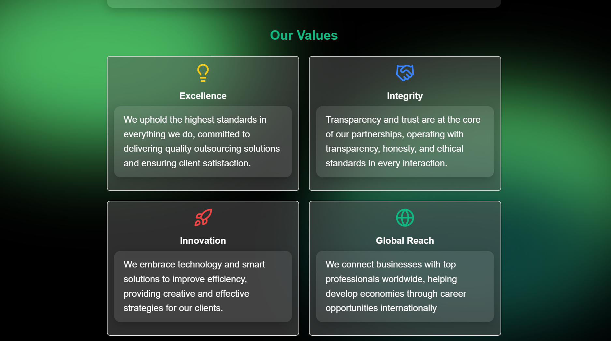

# Welcome to Consult Park

Welcome to Consult Park, a modern, multi-page React web application built to showcase professional business support services. This project demonstrates component-based architecture, responsive design using React Bootstrap, and routing with React Router.

Consult Park is designed for startups and small to mid-sized businesses looking for reliable virtual staffing, administrative help, sales support, bookkeeping, and digital marketing services. The website features a clean, professional UI with interactive elements such as forms and accordions to enhance the user experience.

## Built With


## Table of Contents

- [ Overview](#-overview)  
- [ Features](#-features)   
- [ Screenshots](#-Screenshots)   
- [ Setup Instructions](#️-setup-instructions)  
- [ License](#-license)

---

## Overview
Consult Park is a virtual consultancy platform designed to connect businesses with skilled remote professionals across key operational areas. The platform offers tailored outsourcing solutions to help companies increase efficiency, reduce overhead costs, and focus on core growth strategies.

This website serves as a digital front for Consult Park's services, allowing potential clients to explore offerings, request consultations, and connect with the support team through an intuitive, professional interface.

## Features

- Multi-page react application featuring clean UI and reusable components
- Interactive components
- Contact form with data handling
- Sleek background animations

## Screenshots

### Home Page


### About Us




### Services


### Business Process Outsourcing

.png)
.png)

### Contact Us


### Fully Responsive


## Setup Instructions

To get started with Consult Park locally :

#### Run these in your terminal

1. **React Bootstrap**  
    ```bash
    npm install react-bootstrap bootstrap
    ```

2. **React Router DOM**  
    ```bash
    npm install react-router-dom
    ```
3. **Lucide-react**  
    ```bash
    npm install lucide-react
    ```
4. **Start the project**
    ```bash
    npm start
    ```

---

## Contributors

- [Kai Barker](https://github.com/Kai-Barker)
- [Onthatile Lesufi](https://github.com/Onthatile-Lesufi)
- [Danae Swart](https://github.com/danaeswart)

## Licenses
This project is licensed under the [MIT](https://choosealicense.com/licenses/mit/) License. 